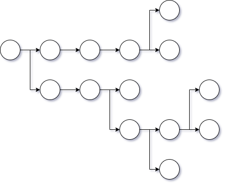
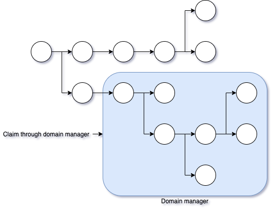
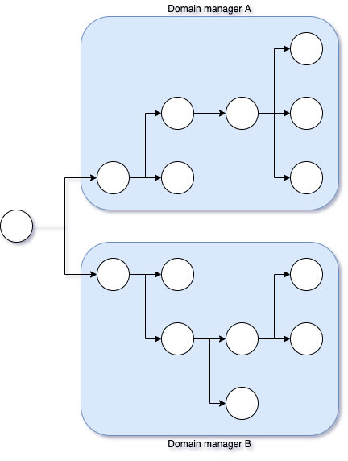
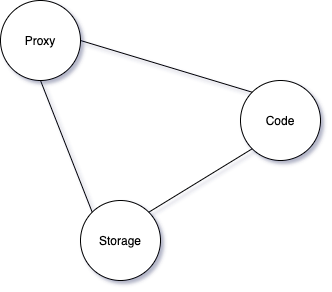

# AKA components

At the core the AKA protocol is the idea that data can be arranged as nodes in a directed acyclic graph (DAG) with auxiliary links and meta data added on top.

As is described in the [whitepaper](https://akap.me/whitepaper), all nodes have one parent, but can have many children. Only the owner of a node can create children of that node. A newly created node is assigned to its creator by default, but can be transfered as defined by the ERC-721 standard. When transfered the original owner relinquishes all rights to that node.

At the root of the DAG we find the root node. No one can ever own the root node and it will never actually exist. Anyone may claim a new child node under the root node, assuming this child node is not already owned by someone else.

The fact that all nodes are somehow connected bring with it a network benefit, making it easy for systems to share data, assuming they each know how to navigate the DAG. It's up to the developer to encode a structure so that sharing of data is enabled, if desired, and we'll explore many patterns for how to enable this.

## AKAP registry contract

At the core of the system we find the AKAP registry contract, enabling and managing the rules of our DAG. This contract is deliberately simple, and does not contain any special administrator or upgrade functionality. The reasoning is that it should function like a bedrock with guarantees around its function, location and abilities. There are no costs, "hidden fees", or similar, and there can never be.

The AKAP registry contract was developed and reviewed in 2019 and then deployed early 2020. On mainnet and major testnets you can find this contract deployed on address [0xaacCAAB0E85b1EfCEcdBA88F4399fa6CAb402349](https://etherscan.io/address/0xaaccaab0e85b1efcecdba88f4399fa6cab402349).

The source code is open and available at [https://github.com/cfelde/AKAP](https://github.com/cfelde/AKAP). With the exception of deploying the AKAP contract to your own local testnet for development and testing purposes, it is otherwise expected that the official 0xaacCAAB0E85b1EfCEcdBA88F4399fa6CAb402349 address is used.

Before reading about AKAP utils next, and depending on how eager you are to dive into code, it might be beneficial to study the [IAKAP interface](https://github.com/cfelde/AKAP/blob/master/contracts/IAKAP.sol) and the [first example on "Using AKAP"](../patterns#getting-started). It's also worth keeping in mind that in addition to implementing the IAKAP interface, the registry contract also implements the [ERC-721 functionality](https://github.com/OpenZeppelin/openzeppelin-contracts/tree/master/contracts/token/ERC721), as defined in the IERC721 interfaces.

We'll return to the specific attributes available on nodes when we look at patterns.

## AKAP utils

With the AKAP registry contract is up and running, everyone is free to build on top of it. While there's is nothing wrong with using it directly, we understand that it might often be a bit "low level" to build directly on top of it. Hence, we also make available a set of utilities, tools and similar, which help you leverage the power of the DAG more easily.

Contrary to the AKAP registry contract, which remains a fixed bedrock, AKAP utils is expected to evolve over time. There are no fixed deployments of these utils, and you are instead encouraged to use them more as a library or starting point in your own smart contracts.

There are many parts included in AKAP utils, and below we dive into them. As with AKAP itself, AKAP utils is also open source software, located on [https://github.com/cfelde/AKAP-utils](https://github.com/cfelde/AKAP-utils).

### Domain manager

As was mentioned in the introduction, the AKAP registry contract maintains a DAG with nodes having one parent and potentially multiple children. Each node has an owner, and the owner is initially assigned to whomever claims the node.

The role of the domain manager is to handle the ownership and access rights to a group of nodes. This is especially beneficial if we have multiple contracts with write access to the same set of nodes. You'd want to ensure that all these contracts claim new nodes via the domain manager, thereby ensuring shared ownership of these nodes.

It's important to understand that nodes are still handled my the same AKAP registry contract, even when using a domain manager. The domain manager only serves as a management layer to make it easier for you to handle multiple nodes together. The domain manager helps you manage what contracts and Ethereum addresses have write access to its group of nodes.

If you have a very complicated set of contracts, where you'd want some contracts to have write access to a set of nodes, and only read access to others, without overlap between themselves, you'd deploy multiple domain managers. While everyone will have read access, only those those contracts with write access would be granted this through the specific domain manager.

The domain manager contract source code is located at [https://github.com/cfelde/AKAP-utils/blob/master/contracts/domain/DomainManager.sol](https://github.com/cfelde/AKAP-utils/blob/master/contracts/domain/DomainManager.sol)

### AKA proxy

While the focus of most of this documentation is on storage patterns enabled by the AKA protocol, being able to relocate code is also very important. If we couldn't relocate code we wouldn't be able to reuse Ethereum addresses. While there are other patterns we can use in AKA to point to new code, which we'll describe in the pattern section, the well known proxy pattern is also supported.

This is done through the AkaProxy contract, with its source code located at [https://github.com/cfelde/AKAP-utils/blob/master/contracts/upgradable/AkaProxy.sol](https://github.com/cfelde/AKAP-utils/blob/master/contracts/upgradable/AkaProxy.sol).

What you might notice on the AkaProxy implementation in particular is the lack of an administrator function to update the implementation address. While this is a typical function on most proxy contracts, we believe this is problematic because it steals a function location. The contract we're pointing to can not itself make use of this function location, because its already in use by the proxy. A proxy with such an administrator type function is therefore not a fully transparent proxy implementation.

The AkaProxy contract solves this by relying on AKAP to store the implementation address in a node field called "seeAddress". Should you need to update this address you can do so via the usual AKAP mechanisms, instead of polluting the proxy contract with such functionality.

### Collections

AKAP utils includes a section for collections. Collections are contracts that provide a specific data structure implementation on top of AKAP, as of which we currently have one.

#### LinkedHashMap

The linked hash map implementation can be found on [https://github.com/cfelde/AKAP-utils/blob/master/contracts/collections/LinkedHashMap.sol](https://github.com/cfelde/AKAP-utils/blob/master/contracts/collections/LinkedHashMap.sol).

The following features are supported:

* Get, put, update and remove entries, all with O(1) complexity
* Enumerate entries in the order they were inserted, either forwards or backwards
* Manage write access using AKAP / domain manager features

Some limitations apply:

* Keys must conform to the requirements of AKAP node labels, being between 1 and 32 bytes.
* Because nodes can never be deleted, removing an entry will leave behind a node.

The first of these limitations can be solved with various techniques to shorten your keys, for example hashing. The second isn't really a problem as the actual data on the node left behind is removed. And should the same key be used again on that map, the existing node will be reused.

If you've ever implemented or looked at the implementation of a hash map / dictionary in a "normal language environment" like Java or Python, you will know that the likelihood of a hash collision is high. This is then handled by allowing for multiple slots, so that different entries can share the same hash.

Our LinkedHashMap is a bit different because we use cryptographic hashes, more specifically the Keccak-256 algorithm, as used to calculate node ids. It is sufficiently statistically unlikely that a map will see a collision, thereby allowing us to avoid the complexity and gas cost of implementing slots.

### Type tools

At the end of the day a node represents a blob of data. The whitepaper specifically leaves it at that, to let the application using a node define its own structure. That means users of nodes would tend to have to handle bytes of unstructured data.

To help with this task, AKAP utils provide a set of libraries and utilities to help you convert to and from bytes and other types. These helpers are located under [https://github.com/cfelde/AKAP-utils/tree/master/contracts/types](https://github.com/cfelde/AKAP-utils/tree/master/contracts/types).

