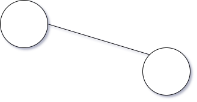
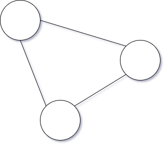

# AKA protocol introduction

The [AKA protocol](https://akap.me) (AKAP) is an idea, a specification, and a set of smart contracts written for the Ethereum blockchain. It tackles a challenge seen on blockchains related to immutability and how you write code to handle such an environment.

In short the challenge facing blockchain developers is that when they deploy code others depend on, there's no easy upgrade path. The location of the code is tied in with the location of storage, and if you want to upgrade your code you can't easily take this storage with you. Deploying a new version would force everyone who depend on it to change their references, not to mention the pain of repopulating existing data.

Eternal storage is a pattern that AKAP can help you leverage, where the idea is to keep your storage separate from your code.

## Eternal storage, code and location

A straight forward and simple Ethereum smart contract would have its storage, code and location all in the same place. The code can write directly to the storage, and both of these are tied to the contract address. There is no way of updating the code or moving the storage to a new location. While this does bring with it many guarantees, many of which we often want to keep, it does not lend itself well to upgradable systems.

There exists proxy patterns, where the location of the code is abstracted away through a proxy contract. When someone makes a call to the proxy contract it will pass on its storage context to code living on another address. As long as the proxy contract contains a mechanism to update the address we can update the code location. This gives us upgradable code, but storage is still tied to the original proxy location.

What AKAP does is to introduce patterns and mechanisms for externalizing the storage location. We can imagine a relationship between our smart contract code, the storage used, and the location like shown below.

With this we are now free to update our code, change or move our storage, and maintain the location details as we see fit. We'll be exploring the components required and the patterns they enable next.

## Reading this documentation

The remainder of this documentation is split into two parts. The first part introduces some of the technical components available as part of AKAP. Thereafter we move on to describing various patterns we can implement with those components.

A general understanding of Ethereum and how to develop and deploy smart contracts on it is expected from the reader.

