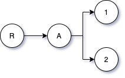

# AKA patterns

There are many ways of using the AKA protocol, from simple single node use cases, to complex and involved multi-layered structures.

Here we'll present some of these, together with code examples published on [https://github.com/cfelde/Using-AKAP](https://github.com/cfelde/Using-AKAP). The primary purpose is to educate and illustrate.

## Getting started

We start with a minimalistic example, one that only uses the AKAP registry contract. It does not rely on anything from AKAP utils.

The full example is available on [Using AKAP -> Getting started](https://github.com/cfelde/Using-AKAP/tree/master/examples/00_Getting_started).

When deploying the [ExampleZero](https://github.com/cfelde/Using-AKAP/blob/master/examples/00_Getting_started/contracts/ExampleZero.sol) contract, in the constructor, we are doing what's called a node claim:

```
uint parent = 0;
require(akap.claim(parent, abi.encode(address(this))) > 0, "Unable to claim node");
node = akap.hashOf(parent, abi.encode(address(this)));
```

We are passing in two things when doing so:

1. The parent id, in this case the value zero, meaning we're allocating this node using the special root parent.
2. A label, in this case a bytes encoding of the contract address, which we can be fairly certain is unused.

We could have used another label, for example one given as a parameter to the constructor itself. That would be up to you as a developer to decide. Use whatever label makes sense to you. Labels are not globally unique by themselves, because the parent relationship is also taken into account. The node id is hence a product of both the parent id and the label.

The parent id could also have been non-zero, which would indicate we're giving it the node id of another node. The only requirement is that we are the owner or we are approved on the parent node, so that we can claim a new child node of that parent node.

When making a claim from a contract we can check the return value. If the return value is greater than zero we can be sure that the node now exists and that we have write access to it.

Just after making the claim, we do a call to `hashOf(..)`, passing in the same parameters as we did for claim. What `hashOf(..)` returns is the node id produced from the parent and the encoded address. This id is how we uniquely identify the node we created. We store this id on a node field in the contract for later use.

Next in the constructor we find:

```
IERC721 erc721 = IERC721(akapAddress);
erc721.setApprovalForAll(msg.sender, true);
```

This illustrates that the AKAP registry contract also implements the ERC-721 interface. From that interface we use the `setApprovalForAll(..)` function, allowing the `msg.sender`, i.e., the contract creator, write access to all nodes created by the contract. If we hadn't done this, all we could do as `msg.sender` is read from nodes created by the contract.

Moving on we now find our first function, `getValue(..)`:

```
function getValue(bytes memory label) public view returns (bytes memory) {
    // There are other fields on a node as well, but we're just
    // going to use the nodeBody here.
    IAKAP akap = IAKAP(akapAddress);
    uint valueId = akap.hashOf(node, label);

    if (akap.exists(valueId)) {
        return akap.nodeBody(valueId);
    } else {
        return "";
    }
}
```

What we're doing here is calling `hashOf(..)`, `exists(..)`, and `nodeBody(..)` on the AKAP registry contract. The first, `hashOf(..)`, we've explained already, but what we're passing in now is not the root node and contract address like we did in the constructor. Instead we are giving it the node id we got earlier + a label. `exists(..)` simply returns true if the node by the given id exists, and `nodeBody(..)` returns any data stored on the node as a sequence of bytes.

Using this `valueId` we can read values from nodes that are children of the node we created in the constructor. The next two functions do this:

```
function getValue1() public view returns (bytes memory) {
    bytes memory k = new bytes(1);
    k[0] = byte(uint8(1));
    return getValue(k);
}

function getValue2() public view returns (bytes memory) {
    bytes memory k = new bytes(1);
    k[0] = byte(uint8(2));
    return getValue(k);
}
```

All they do is pass in a key with value 1 or 2 into the `getValue(..)` function. From that we can deduct that we have the following node structure on this contract:



* R - this is the special root node, with parent id zero
* A - the node created by the contract in its constructor, using address as a label
* 1 - node is used by `getValue1()`
* 2 - and node by `getValue2()`

So far, so good, but how can we read any value from these nodes when the contract doesn't assign any values to them? Well, if you remember, in the constructor, we granted `msg.sender` write access to the node created. If we shift our attention to the [exampleZero.js](https://github.com/cfelde/Using-AKAP/tree/master/examples/00_Getting_started/test/exampleZero.js) test file, we find among other things this:

```
let value1A = "Value 1 is a string";
let value2A = 1234;

await setAkapChildValue(akapInstance, node, [0x1], web3.utils.toHex(value1A));
await setAkapChildValue(akapInstance, node, [0x2], web3.utils.toHex(value2A));
```

The `setAkapChildValue(..)` allows us to set these values, on those nodes. Hence, the contract can read them as well.

Next in the contract, we have an `increaseCounter()` function, illustrating how the contract can write data to a node. In this example it is writing directly to the node created in the constructor. This makes it clear that a node with children can still hold data and function like any other node. Parenthood doesn't make nodes special.

```
function increaseCounter() public {
    IAKAP akap = IAKAP(akapAddress);

    // Read current counter value
    bytes memory counter = akap.nodeBody(node);

    uint x;
    if (counter.length == 0) {
        // First call, set to 1
        x = 1;
    } else {
        assembly {
            x := mload(add(counter, 0x20))
        }
        // Not first call, increase value by 1
        x++;
    }

    counter = new bytes(32);
    assembly {
        mstore(add(counter, 32), x)
    }

    // Store the updated counter on node
    akap.setNodeBody(node, counter);
}
```

If the low level assembly stuff looks frightening then look at [type tools](../components#type-tools) from AKAP utils. In short, all the function is doing is incrementing a uint value each time the function is called.

As the final concept in this example we have the `reclaim()` function.

```
function reclaim() public {
    IAKAP akap = IAKAP(akapAddress);
    uint parent = 0;

    // You reclaim just like you claim initially
    require(akap.claim(parent, abi.encode(address(this))) > 0, "Unable to claim node");
}
```

Doing a reclaim illustrates an important concept in the AKA protocol. The [whitepaper](https://akap.me/whitepaper) explains it in more detail, but because there will never be a fee or payment associated with owning nodes, another mechanism is used to ensure dead nodes can be managed.

In short, if a node has not been reclaimed for more than 52 weeks the parent node owner, or those granted access to the parent, can claim these nodes and take ownership. Returning to our contract node structure again we have node A, 1, and 2 created by the contract. The contract creator was also granted access in the constructor.


Because only node A has the special root node as its parent, it is only important to reclaim that node. Node 1 and 2 are owned by node A, so they are never at risk of being claimed by others as long as we maintain ownership of node A.

To help with the process we've implemented the reclaim function on our example contract. This function can be called by anyone, and as long as someone calls it often enough, node A remains a property of the contract.

## Domain manager

We're now moving on to the next example, located at [Using AKAP -> Domain manager](https://github.com/cfelde/Using-AKAP/tree/master/examples/01_Domain_manager)

Comparing this to the previous example and you'll recognize most of the code with two primary differences:

* We are using the [Domain Manager](https://github.com/cfelde/AKAP-utils/blob/master/contracts/domain/DomainManager.sol) to manage our node structure
* We're using some of the [type tools and libraries](https://github.com/cfelde/AKAP-utils/tree/master/contracts/types) to help us with the bytes

So let's walk through the code, firstly looking at the [deployment script](https://github.com/cfelde/Using-AKAP/blob/master/examples/01_Domain_manager/migrations/2_deploy_contracts.js). A lot of the setup is done in there, starting with the domain manager and a random label we create on the fly:

```
let randomLabel = new Array(32)
for (let i = 0; i < randomLabel.length; i++) {
    randomLabel[i] = Math.floor(Math.random() * 256)
}

console.log("Using random label = " + randomLabel);

let dm = await deployer.deploy(domainManager, akapAddress(network), 0x0, randomLabel);
```

We don't need to use a random label, but at the same time we don't really care what the label is, as long as we can reference it later. Continuing on, we next obtain the root pointer, which is created from, again, using the special root parent as in the previous example, and our label.

```
let akapInstance = await akap.at(akapAddress(network));
let rootPtr = await akapInstance.hashOf(0x0, randomLabel);

console.log("Deployed domain manager, with root pointer = 0x" + rootPtr.toString(16));

let instance = await deployer.deploy(exampleOne, await dm.address, rootPtr);
```

The last line of the above code deploys our example contract, here called [ExampleOne](https://github.com/cfelde/Using-AKAP/blob/master/examples/01_Domain_manager/contracts/ExampleOne.sol). We give the constructor of the contract the domain manager address and the root pointer. Looking at the contract constructor code we find:

```
constructor(address _dmAddress, uint _rootPtr) public {
    dm = DomainManager(_dmAddress);
    akap = dm.akap();
    rootPtr = _rootPtr;

    require(akap.exists(rootPtr), "ExampleOne: No root pointer");
}
```

As we can see, there's not much going on in there, much less than we had in the previous example. We think this is good, keeping setup code outside the contract itself.

Going back to the deployment script, the final thing we do there is to approve the contract as a writer to the nodes. This is done on the domain manager, not the AKAP registry contract. It's important to use the domain manager for any such calls relating to nodes within its domain.

```
await dm.setApprovalForAll(await instance.address, true);
```

Taking a step back, the primary difference here, between this example and the previous, is that we externalize responsibility around maintaining nodes and the domain nodes operate within to the domain manager contract. You will for example notice that the ExampleOne contract does not contain a reclaim function, like we had in ExampleZero. Again, this is because we've delegated that sort of functionality to the domain manager, which already gives us a reclaim function out of the box.

Leaving this sort of functionality to a dedicated domain manager, rather than polluting your own contract with administrator features, makes a lot of sense. Using the node structure from the AKAP registry contract allows us to externalize this like we've done here.

Finally a few words on the [type tools](https://github.com/cfelde/AKAP-utils/tree/master/contracts/types). While these don't play a significant role, they help clean up some of the boilerplate code we had in the first example. Converting between bytes, as stored in the node body, and types we want to work with becomes a lot easier. The code looks cleaner, with less distractions. All the assembly code is removed.

```
function getValue(uint key) public view returns (bytes memory) {
    uint valueId = akap.hashOf(rootPtr, key.asBytes());

    if (akap.exists(valueId)) {
        return akap.nodeBody(valueId);
    } else {
        return "";
    }
}

function getValue1() public view returns (string memory) {
    return getValue(1).asString();
}

function getValue2() public view returns (uint) {
    return getValue(2).asUint256();
}

function increaseCounter() public {
    // Read current counter value
    uint x = akap.nodeBody(rootPtr).asUint256();

    // Increase by 1
    x += 1;

    // Store the updated counter on node
    akap.setNodeBody(rootPtr, x.asBytes());
}
```

You'll find the type tools being used with calls like `asString()`, `asUint256()`, and `asBytes()`. 

Also take a look at how the [testing](https://github.com/cfelde/Using-AKAP/blob/master/examples/01_Domain_manager/test/exampleOne.js) is done in this example, and compare that to the previous. One major difference is the use of `ConvertUtils`, allowing us to do the same type conversions on the client side. This is still an area in flux, and likely there will be a client side tool in the future so you don't need to reference a contract.

## More patterns

In the coming days and weeks we'll be extending this with many more examples.
